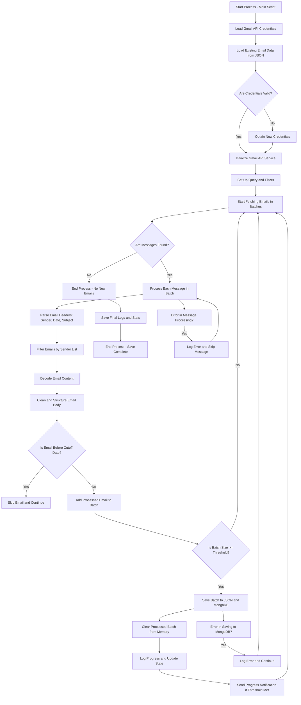

```mermaid
---
config:
  layout: fixed
---
flowchart TD
    A["Start Process - Main Script"] --> B["Load Gmail API Credentials"]
    B --> C["Load Existing Email Data from JSON"]
    C --> D{"Are Credentials Valid?"}
    D -- Yes --> E["Initialize Gmail API Service"]
    D -- No --> F["Obtain New Credentials"]
    F --> E
    E --> G["Set Up Query and Filters"]
    G --> H["Start Fetching Emails in Batches"]
    H --> I{"Are Messages Found?"}
    I -- No --> Z["End Process - No New Emails"]
    I -- Yes --> J["Process Each Message in Batch"]
    J --> K["Parse Email Headers: Sender, Date, Subject"] & AC["Error in Message Processing?"]
    K --> L["Filter Emails by Sender List"]
    L --> M["Decode Email Content"]
    M --> N["Clean and Structure Email Body"]
    N --> O{"Is Email Before Cutoff Date?"}
    O -- Yes --> Q["Skip Email and Continue"]
    O -- No --> P["Add Processed Email to Batch"]
    P --> R{"Is Batch Size >= Threshold?"}
    R -- Yes --> S["Save Batch to JSON and MongoDB"]
    S --> T["Clear Processed Batch from Memory"] & AE["Error in Saving to MongoDB?"]
    T --> U["Log Progress and Update State"]
    U --> V["Send Progress Notification if Threshold Met"]
    V --> H
    R -- No --> H
    Z --> AA["Save Final Logs and Stats"]
    AA --> AB["End Process - Save Complete"]
    AC -- Yes --> AD["Log Error and Skip Message"]
    AD --> J
    AE -- Yes --> AF["Log Error and Continue"]
    AF --> H
```
