```mermaid
%%{init: {'theme': 'default', 'themeVariables': { 'fontFamily': 'trebuchet ms'}}}%%
flowchart TD

%% SYSTEM INITIALIZATION AND CONFIGURATION %%
subgraph "System Initialization and Configuration" [A]
    A1[Start Process - background_processor.py] --> A2[Load Environment Variables - background_processor.py]
    A2 --> A3{Are Env Variables Loaded?}
    A3 -- Yes --> A4[Initialize Logging with Debug Mode - background_processor.py]
    A3 -- No --> A5[Log Missing Variables - background_processor.log] --> A6[Exit Process]
    A4 --> A7[Load Gmail API Credentials - parsegmail.py]
    A7 --> A8{Credentials Valid?}
    A8 -- Yes --> A9[Check for Token in token.pickle - parsegmail.py]
    A8 -- No --> A10[Log Invalid Credentials - parsegmail.py]
    A9 --> A11{Token Exists?}
    A11 -- Yes --> A12[Load Existing Token - parsegmail.py]
    A11 -- No --> A13[Initiate OAuth2 Flow - parsegmail.py]
    A13 --> A14[Save New Token to token.pickle]
    A14 --> A15[Load Filtered Senders - gmailextract.py]
    A15 --> A16[Load Existing JSON Data - incremental_email_handler.py]
    A16 --> A17[Connect to MongoDB - mongo_loader.py]
    A17 --> A18{Is MongoDB Connection Active?}
    A18 -- Yes --> A19[Initialize Database and Collection - mongo_loader.py]
    A18 -- No --> A20[Log Connection Failure - mongo_loader.log] --> A6
    A19 --> A21[Load Existing Email IDs from JSON and MongoDB - incremental_email_handler.py]
    A21 --> A22[Construct Gmail API Query with Cutoff Date - gmailextract.py]
end
```

```mermaid
%% FETCHING EMAILS FROM GMAIL %%
subgraph "Fetching Emails from Gmail and Initial Processing" [B]
    B1[Begin Fetching Emails - gmailextract.py] --> B2{Messages Found?}
    B2 -- No --> B3[End Process - No New Emails]
    B2 -- Yes --> B4[Process Each Email Message - gmailextract.py]
    B4 --> B5[Extract Headers - gmailextract.py] 
    B5 --> B6{Header Data Complete?}
    B6 -- Yes --> B7[Parse Date with Timezone Handling - parse_date()]
    B6 -- No --> B8[Log Header Incomplete - gmail_filter.log] --> B4
    B7 --> B9{Within Cutoff Date?}
    B9 -- Yes --> B10[Filter by Sender - gmailextract.py]
    B9 -- No --> B11[Skip Email and Continue - Log Skipped Email]
    B10 --> B12{Sender in FILTER_SENDERS?}
    B12 -- Yes --> B13[Prepare for Content Decoding - gmailextract.py]
    B12 -- No --> B11
    B13 --> B14[Identify Encoding - decode_content()]
    B14 --> B15[Decode Base64, Quoted-Printable, or 7-bit - decode_content()]
    B15 --> B16{Is Content HTML?}
    B16 -- Yes --> B17[Clean HTML with BeautifulSoup - clean_html_content()]
    B16 -- No --> B18[Proceed with Plain Text]
    B17 --> B19[Extract URLs and Normalize Text - EmailCleaner.extract_urls()]
    B19 --> B20[Normalize Content (remove whitespace, special chars) - EmailCleaner.clean_text()]
    B20 --> B21[Structure Cleaned Content for Storage]
    B5 --> BE1[Log Header Parsing Error - gmail_filter.log]
    B14 --> BE2[Log Decoding Error - gmail_filter.log]
    B17 --> BE3[HTML Cleaning Error - gmail_filter.log]
    B20 --> BE4[Log Normalization Error - gmail_filter.log]
end
```
```mermaid
%% BATCH PROCESSING AND MONGODB STORAGE %%
subgraph "Batch Processing and MongoDB Storage" [C]
    C1{Batch Size Threshold Reached?}
    C1 -- Yes --> C2[Save Current Batch to JSON - incremental_email_handler.py]
    C2 --> C3[Backup Existing JSON - incremental_email_handler.py]
    C3 --> C4[Attempt MongoDB Connection - mongo_loader.py]
    C4 --> C5{MongoDB Connected?}
    C5 -- Yes --> C6[Initialize Database for Insert - mongo_loader.py]
    C5 -- No --> C7[Log MongoDB Connection Error - mongo_loader.log] --> C8[Retry Connection - mongo_loader.py]
    C6 --> C9[Batch Processing to MongoDB - mongo_loader.load_data()]
    C9 --> C10[Transform Data to MongoDB Format]
    C10 --> C11[Insert Documents in MongoDB Collection]
    C11 --> C12{Insertion Error?}
    C12 -- Yes --> C13[Log Insert Failure - mongo_loader.log]
    C13 --> C8
    C11 --> C14[Clear Processed Batch from Memory]
    C14 --> C15[Update Process Log with Progress - background_processor.py]
    C15 --> C16{Notification Threshold Reached?}
    C16 -- Yes --> C17[Send Progress Notification - background_processor.py]
    C16 -- No --> B1
end
```
```mermaid
%% FINAL VERIFICATION AND MONGODB SYNC %%
subgraph "Final Verification and MongoDB Sync" [D]
    D1[Begin Verification - verify_mongo_data.py]
    D1 --> D2{Is MongoDB in Sync with JSON?}
    D2 -- Yes --> D3[Verification Successful - Log Completion]
    D2 -- No --> D4[Send Discrepancy Notification - background_processor.py]
    D4 --> D5[Load JSON and MongoDB Data - sync_mongodb.py]
    D5 --> D6[Compare Document Counts]
    D6 --> D7{Discrepancy Found?}
    D7 -- Yes --> D8[Identify Missing Documents]
    D7 -- No --> D3
    D8 --> D9[Insert Missing Documents into MongoDB]
    D9 --> D10[Run Final Verification Check]
    D10 --> D11{Verification Successful?}
    D11 -- Yes --> D12[Log Successful Sync Completion]
    D11 -- No --> D13[Log Discrepancy Issue - background_processor.log]
end
```
```mermaid
%% ERROR HANDLING BREAKDOWN %%
subgraph "Detailed Error Handling and Transformation Points" [E]
    E1[Header Parsing Error - gmailextract.py] --> F1[Log and Skip Message]
    E2[HTML Cleaning Error - decode_and_extract_text()] --> F2[Log Error and Continue]
    E3[Decoding Error - decode_content()] --> F3[Log Error and Use Default Decoding]
    E4[Text Normalization Error - clean_text()] --> F4[Log Issue and Proceed with Partial Text]
    E5[MongoDB Connection Error - mongo_loader.py] --> F5[Retry Connection with Exponential Backoff]
    E6[Duplicate Key Error during Insert - mongo_loader.load_data()] --> F6[Log Duplicate and Continue]
    E7[Data Discrepancy in Sync - sync_mongodb.py] --> F7[Notify User and Log Details]
    F1 --> G1[Continue Processing Remaining Messages]
    F2 --> G2[Proceed with Next Email]
    F3 --> G3[Retry Decoding if Possible, Else Skip]
    F4 --> G4[Proceed with Available Content]
    F5 --> G5[Attempt MongoDB Reconnect]
    F6 --> G6[Skip Duplicate Document]
    F7 --> G7[Log Data Inconsistency]
end
```
